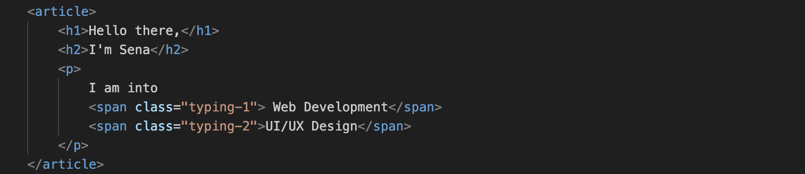
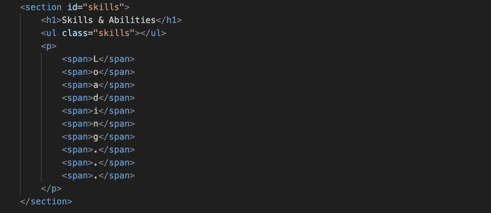

# WEB APP FROM STRATCH @cmd-minor-web 2023-2024

Welcome to my mini demo-portfolio site created for the Webapps From Scratch course. This site serves as a showcase of my skills. Whether you're a potential employer, collaborator, or just someone curious about what I do, I'm glad you stopped by.

## Table of Contents

- [:wrench: Introduction](#wrench-introduction)
- [:page_with_curl: Assignment](#page_with_curl-assignment)
- [:white_check_mark: Requirements](#white_check_mark-the-requirements-of-the-assignment)
- [:hammer: Build with](#hammer-build-with)
- [:v: How to clone](#v-how-to-clone)
- [:black_nib: Author](#black_nib-author)
- [:copyright: License](#copyright-licence)
- [:cd: Live demo](#cd-live-demo)
- [:bulb: Features](#bulb-features)

## :wrench: INTRODUCTION

This website is built using just basic HTML, CSS, and JavaScript. I've created a simple, single-page website that retrieves information from another website and displays it here. Through this project, I've learned how to test and improve site design, allowing me to create mock-up websites with real information and gain a deeper understanding of how websites work behind the scenes.

## :page_with_curl: ASSIGNMENT

During this course, I should:

1. Develop a single-page application (SPA) or website incorporating external data from an API, complete with at least one micro-interaction.
2. Collaborate on a team app that features the individual websites of each team member.

## :white_check_mark: THE REQUIREMENTS OF THE ASSIGNMENT

My efforts are assessed using a rubric. I must pass the criteria below to pass the grade:

The project;

- is made with clean vanilla HTML, CSS en Javascript,
- includes diverse content,
- includes at least one micro-interaction made in detail using JS,
- includes at least one data-connection through an API call,
- includes the correct data for the integration with the team app,
- is accessible,
- has a professional design and styling,
- is completely responsive,
- is documented.

## :hammer: BUILD WITH

    
    
    
    

- Semantically correct HTML
- Clear CSS
- Vanilla JavaScript
- Git

## :cd: LIVE DEMO

You can reach the demo-website via [this link](https://sensinki.github.io/web-app-from-scratch-2324/)

## :v: HOW TO CLONE?

You have to clone this repository in order to use this app. Use the following command in your terminal:

<pre> 
    <code>git clone https://github.com/Sensinki/web-app-from-scratch-2324.git</code>
</pre>

## :black_nib: AUTHOR

This project is made by [Sena Nur Korkutan](https://github.com/Sensinki).

## :copyright: LICENCE

This project uses the [MIT License](https://github.com/Sensinki/web-app-from-scratch-2324?tab=MIT-1-ov-file).

## :bulb: FEATURES

I've chosen to focus on a few simple micro-interactions. You can read an overview of the features on the table below:

- [Scroll snap for each section](#scroll-snap)
- [No animation if user "prefers-reduced-motion: reduce" mode](#no-animation)
- [Typewriting effect](#typewriting-effect)
- [Random activity generator API](#random-activity-generator)
- [Json for skills](#json-for-skills)
- [Backdrop filter for header](#backdrop-filter)
- [Loading animation](#loading-animation)
- [Sending email with form submission](#sending-email-with-form)

### SCROLL SNAP

I divided each part of the page like about, skills, contact into sections and gave these sections a scroll snap effect as follows.

### NO ANIMATION

My website has a few animations moving around and this animations can be annoying for people who don't want it. So for those people I used the following code:

### TYPEWRITING EFFECT

I wanted to use the typewriting effect in an old project, but I didn't succeed because I didn't know how to, so I wanted to include it in this project and I succeeded with the code below:

### RANDOM ACTIVITY GENERATOR

I needed to use an external api for the site I made and I wanted to use an api that can select random activity. I was able to do this using the javascript code as follows:

### JSON FOR SKILLS

While making this feature, I was able to understand JSON and API, which I had struggled to understand for a long time. Firstly, I created a skills.json file containing all my skills and learned how to fetch them using javascript (I got some help from chatgpt on this part). This task, which I gave myself, allowed me to learn how to easily create elements with JavaScript and see how I could manipulate them. Below you can see the code I used to do this:

### BACKDROP FILTER

The part I had the most difficulty in making the header part was giving blur to the background. I didn't know there was such a thing as a backdrop-filter and I was constantly trying other options, but after I discovered the existence of such a feature, it was much easier. With a very short two lines of css code, I managed to blur the part that comes behind the header like this:

After I discovered the backdrop-filter, I used it not only for blurring, but also for inverting.

### LOADING ANIMATION

I decided to make a loading animation to show that the skills are loaded, i.e. I am still in the development phase. I did it like this:

### SENDING EMAIL WITH FORM

I wanted the form I created in the contact section to function correctly and I wanted the message written there to come to my own e-mail. After a long search, I found out that I can do this most easily and efficiently using another service, and I only need to use html. I found this method through tutorials. What I do to send the form is to give a post method to the form and I have access to use this service with the key that the site gives me. I did this as follows:

---
If you are interested in the process, I also have a wiki for this project. You can find it in the "Wiki" tab of the repository.
